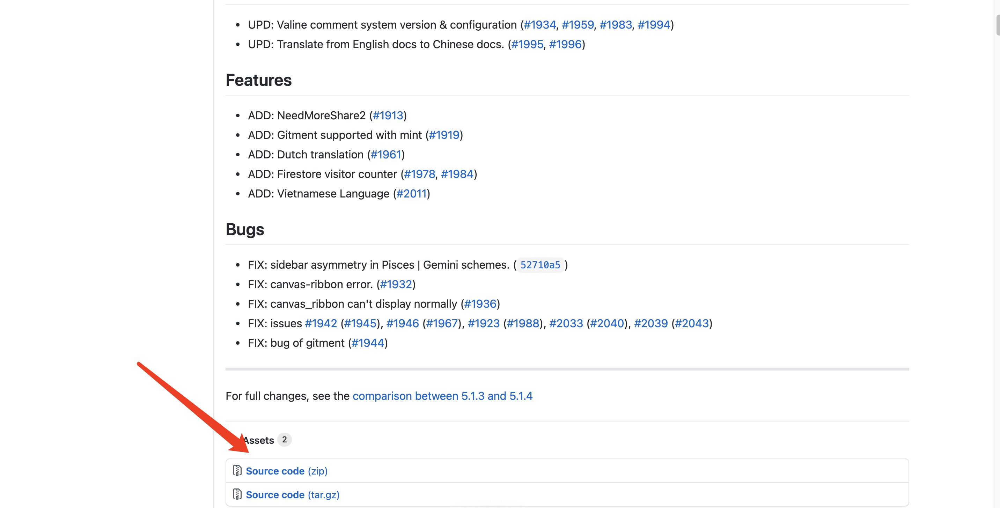
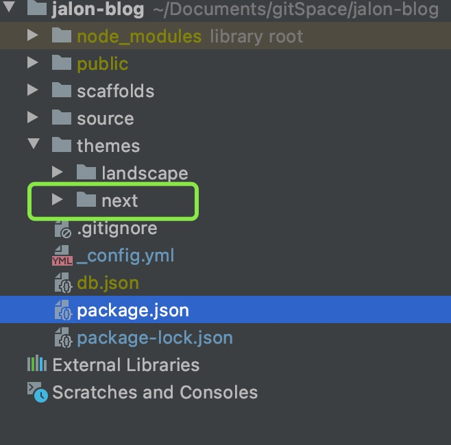
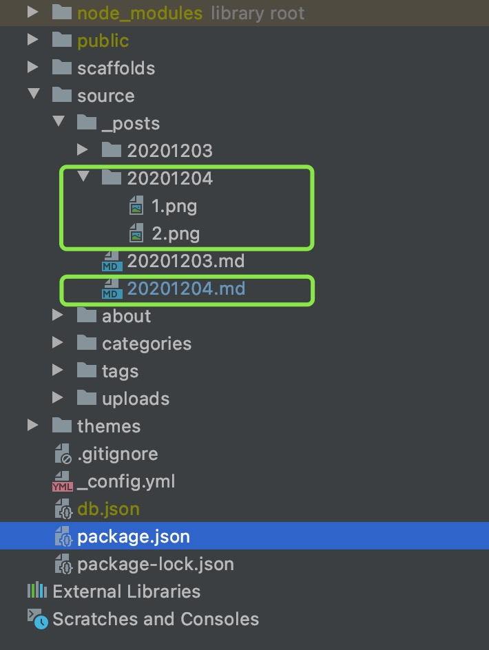
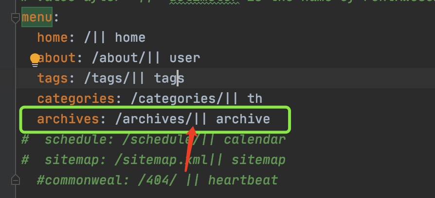

<!-- TOC -->
## 步骤
1. [安装NexT](#installNexT)
2. [配置NexT](#NexTConfig)
3. [问题](#question)
4. [链接](#link)
<!-- TOC -->

## <p id="installNexT">安装NexT</p>
- [NexT下载页面](https://github.com/iissnan/hexo-theme-next/releases)
- 点击下载NexT主题ZIP包

- 下载完成后解压重命名为next
``` 
unzip hexo-theme-next-5.1.4.zip 
mv hexo-theme-next-5.1.4 next
```
- 放到项目下/themes文件夹下

- 修改配置文件
``` 
项目目录下/_config.yml
theme: landscape
修改为
theme: next
```
- 现在启动项目访问[本地服务](http://localhost:4000/) 看到主题已经生效了（启动前先清理一下Hexo 缓存，前一章有写）

## <p id="NexTConfig">配置NexT</p>
 - [NexT官方文档](http://theme-next.iissnan.com/getting-started.html#theme-settings)
 - NexT配置文件地址（在文档中的名称为**主题配置文件**）
``` 
项目目录/themes/next/_config.yml
```
 - 项目配置文件地址（在文档中的名称为**站点配置文件**）
``` 
项目目录/themes/next/_config.yml
```
官网介绍的很详细就不在写一遍了

## <p id="question">问题</p>

 - 如何新建文章
``` 
hexo new <title> 

项目目录/source/_posts/下会生成名为title.md的文件
```
 - 在文章内引用图片
```
npm install hexo-asset-image

安装 hexo-asset-image 后 新建文章时会在 项目目录/source/_posts/下 生成名为 title的文件夹和名为title.md的文件
将图片放到文件夹内，引用方法：
```


 - 如果上面的引用图片不好用
```
npm install hexo-asset-image https://github.com/Zjalon/hexo-asset-image.git

我用的hexo是4.0.0版本的，hexo-asset-image 存在bug，我在github上fork了一份没有bug的版本，可以安装这个
```

- 提交代码后coding重新部署完，页面完全空白
  仔细看一下，themes文件夹下的主题文件夹是否提交上去了，我就遇到了这个问题，因为我的主题是
  通过git clone的方式下载到themes的文件夹下的，不是下载的安装包解压的，提交代码时，这个文件夹没有被提交（也可能是别的原因，我没有继续调查）
  看一下自己的仓库，themes文件夹下是否有自己使用的主题就ok了
- 根据NexT官网教程设置打开关于,标签等菜单后在浏览器访问显示错误

  注意删除"||"前面的空格
  
  

## <p id="link">链接</p>
 - [NexT下载页面](https://github.com/iissnan/hexo-theme-next/releases)
 - [Next官网](http://theme-next.iissnan.com/)
 - [Hexo中文文档](https://hexo.io/zh-cn/docs/)
